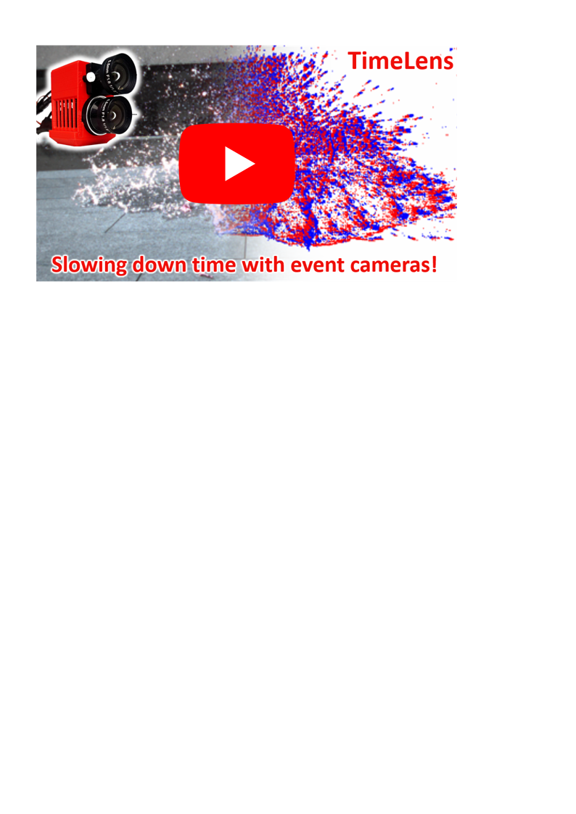

# TimeLens: Event-based Video Frame Interpolation

<p align="center">
  <a href="https://youtu.be/dVLyia-ezvo">
    
  </a>
</p>

This repository is about the High Speed Event and RGB (HS-ERGB) dataset, used in the 2021 CVPR paper [**TimeLens: Event-based Video Frame Interpolation**](http://rpg.ifi.uzh.ch/docs/CVPR21_Gehrig.pdf) by Stepan Tulyakov*, [Daniel Gehrig*](https://danielgehrig18.github.io/), Stamatios Georgoulis, Julius Erbach, [Mathias Gehrig](https://magehrig.github.io/), Yuanyou Li, and [Davide Scaramuzza](http://rpg.ifi.uzh.ch/people_scaramuzza.html).

For more information, visit our [project page](http://rpg.ifi.uzh.ch/timelens).


### Citation
A pdf of the paper is [available here](http://rpg.ifi.uzh.ch/docs/CVPR21_Gehrig.pdf). If you use this dataset, please cite this publication as follows:

```bibtex
@Article{Tulyakov21CVPR,
  author        = {Stepan Tulyakov and Daniel Gehrig and Stamatios Georgoulis and Julius Erbach and Mathias Gehrig and Yuanyou Li and
                  Davide Scaramuzza},
  title         = {{TimeLens}: Event-based Video Frame Interpolation},
  journal       = "IEEE Conference on Computer Vision and Pattern Recognition",
  year          = 2021,
}
```
## Google Colab
A Google Colab notebook is now available [here](TimeLens.ipynb). You can upsample your own video and events from you gdrive. 

## Gallery
For more examples, visit our [project page](http://rpg.ifi.uzh.ch/timelens).


## Installation
Install the dependencies with 

    cuda_version=10.2
    conda create -y -n timelens python=3.7
    conda activate timelens
    conda install -y pytorch torchvision cudatoolkit=$cuda_version -c pytorch
    conda install -y -c conda-forge opencv scipy tqdm click

## Test TimeLens
First start by cloning this repo into a new folder

    mkdir ~/timelens/
    cd ~/timelens
    git clone https://github.com/uzh-rpg/rpg_timelens

Then download the checkpoint and data to the repo

    cd rpg_timelens
    wget http://download.ifi.uzh.ch/rpg/web/data/timelens/data2/checkpoint.bin
    wget http://download.ifi.uzh.ch/rpg/web/data/timelens/data2/example_github.zip
    unzip example_github.zip 
    rm -rf example_github.zip

### Running Timelens
To run timelens simply call 

    skip=0
    insert=7
    python -m timelens.run_timelens checkpoint.bin example/events example/images example/output $skip $insert

This will generate the output in `example/output`. 
The first four variables are the checkpoint file, image folder and event folder and output folder respectively.
The variables `skip` and `insert` determine the number of skipped vs. inserted frames, i.e. to generate a 
video with an 8 higher framerate, 7 frames need to be inserted, and 0 skipped.

The resulting images can be converted to a video with 

    ffmpeg -i example/output/%06d.png timelens.mp4

the resulting video is `timelens.mp4`.

## Dataset


Download the dataset from our [project page](http://rpg.ifi.uzh.ch/timelens). The dataset structure is as follows

```
.
├── close
│   └── test
│       ├── baloon_popping
│       │   ├── events_aligned
│       │   └── images_corrected
│       ├── candle
│       │   ├── events_aligned
│       │   └── images_corrected
│       ...
│
└── far
    └── test
        ├── bridge_lake_01
        │   ├── events_aligned
        │   └── images_corrected
        ├── bridge_lake_03
        │   ├── events_aligned
        │   └── images_corrected
        ...

```
Each `events_aligned` folder contains events files with template filename `%06d.npz`, and `images_corrected` contains image files with template filename `%06d.png`. In `events_aligned` each event file with index `n` contains events between images with index `n-1` and `n`, i.e. event file `000001.npz` contains events between images `000000.png` and `000001.png`. Moreover, `images_corrected` also contains `timestamp.txt` where image timestamps are stored. Note that in some folders there are more image files than event files. However, the image stamps in `timestamp.txt` should match with the event files and the additional images can be ignored.

For a quick test download the dataset to a folder using the link sent by email.

    wget download_link.zip -O /tmp/dataset.zip
    unzip /tmp/dataset.zip -d hsergb/

And run the test

    python test_loader.py --dataset_root hsergb/ \ 
                          --dataset_type close \ 
                          --sequence spinning_umbrella \ 
                          --sample_index 400
                                              
This should open a window visualizing aligned events with a single image.
